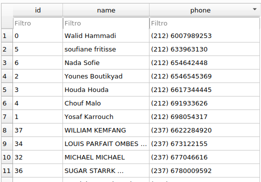
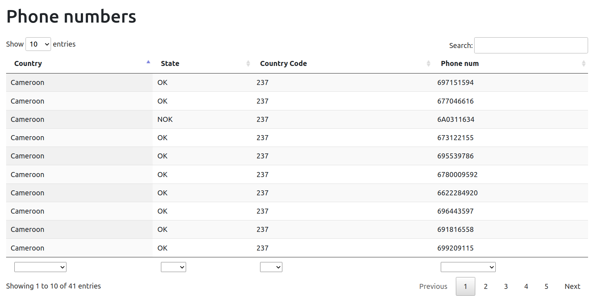
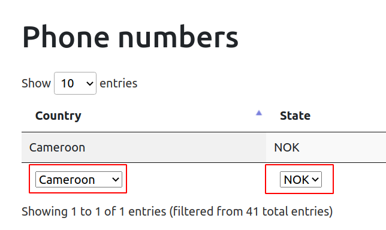
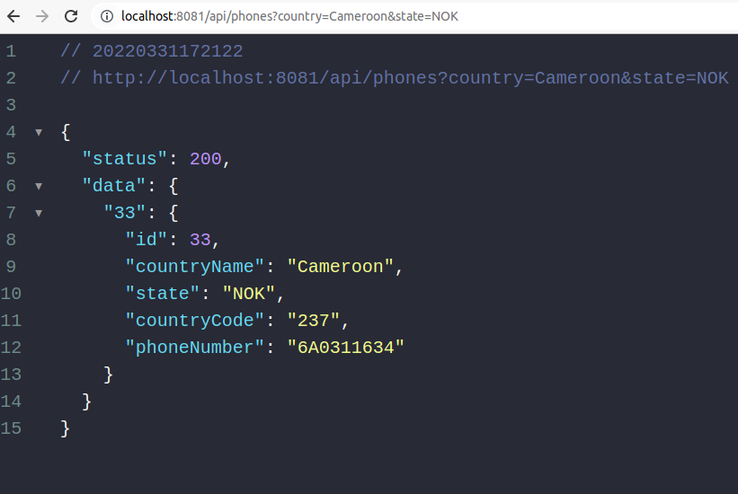
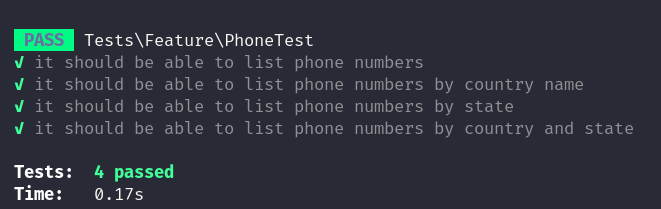

# Phone numbers

## Overview
SPA to list customer phone numbers.

## Technologies
- Laravel 9x;
- Docker with Laravel Sail;
- SQLite;
- Bootstrap with Datatables.

## Architecture

### Database
I'm using an SQLite database to fetch customer data.

The database file is located at database/sample.db

This database has only a table named `customer`:



### Project structure
```tree
├── app
│   ├── Http
│   │   └── Controllers
│   │       └── PhoneController.php  #Controller used to interact with the API.
│   ├── Repositories
│   │   └── CustomerRepository.php # Repository to interact with `Customer` model.
│   ├── Services
│   │   └── PhoneListService.php #Get, format and return phone numbers to the PhoneController.
│   │   └── Phone.php #Get specific data from phone numbers.
│   │   └── Countries
│   │       └── CountryInformation.php #Get specific data from the country.
│   │       └── CountriesInterface.php #An interface that provides a default method to validate phone number.
│   │       └── Cameroon.php #Validate phone number from country "Cameroon".
│   │       └── Ethiopia.php #Validate phone number from country "Ethiopia".
│   │       └── Morocco.php #Validate phone number from country "Morocco".
│   │       └── Mozambique.php #Validate phone number from country "Mozambique".
│   │       └── Uganda.php #Validate phone number from country "Uganda".
│   └── Models #Application models.
├── database
│   └── sample.db #SQLite database with customer data.
├── resources
│   └── views
│       └── welcome.blade.php #View of http://localhost:8081/ URL.
├── tests
│   └── Feature
│       └── PhoneTest.php #Automated tests from the API http://localhost:8081/api/phones.
```

## Installation:
1. Install [docker and docker-compose](https://docs.docker.com/get-docker/);
2. This project use [Laravel Sail](https://laravel.com/docs/9.x/sail), for this reason, execute the following commands in your terminal:
    - ```bash
        docker run --rm \
            -u "$(id -u):$(id -g)" \
            -v $(pwd):/var/www/html \
            -w /var/www/html \
            laravelsail/php81-composer:latest \
            composer install --ignore-platform-reqs
      ```
        Note: More information about the command above could be found here: https://laravel.com/docs/9.x/sail#executing-composer-commands
    - ```bash
      alias sail='[ -f sail ] && bash sail || bash vendor/bin/sail'
      ```
    - ```bash
      sail up
      ```
3. Open http://localhost:8081/ and the following page should be displayed:

    

## How to use this application:

1. This APP displays information about customer phone numbers. You are free to filter these data according to your needs.

    Example - Filtering country "Cameroon" and state "NOK":

    

## How to use the API:

We provide an API for you to use as you see fit.

### Endpoints

#### List all customers phones:

* **Description:**

  Returns a list of customer phones numbers in JSON format.

* **URL:**

  http://localhost:8081/api/phones

* **Method:**

  `GET`

* **Example:**

    


#### List all customers phones by country and state:

* **Description**

  Returns a list of customer phones numbers in JSON format based on the filters "country" or "state".

  Note: You can use one of them or both at the same time.

* **URL:**

  http://localhost:8081/api/phones

* **Method:**

  `GET`

*  **URL Params**

   **Optional:**

   `country=[string]`

   `state=[string]`

* **Example:**

    


## Automated tests:
This project is covered by automated tests.

### Where the test file is located?
The feature test is located at `tests/Feature/PhoneTest.php`.

### How to run the automated tests:
1. Execute the following commands in your terminal:
    - ```bash
      alias sail='[ -f sail ] && bash sail || bash vendor/bin/sail'
      ```
    - ```bash
      sail test

2. The tests results should be displayed as image below:

    
