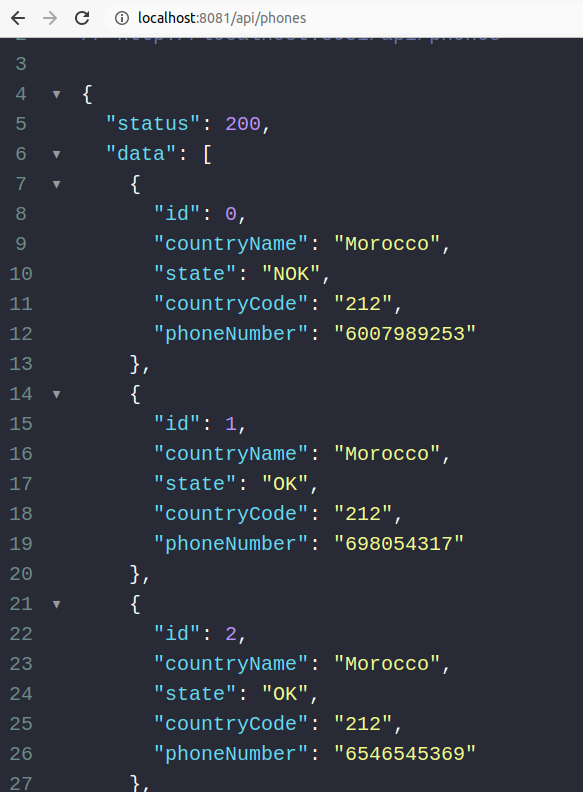

# Phone Number Categorization

## Overview
Single page application to list and categorize country phone numbers.

## Technologies
- Laravel 9x;
- Docker with Laravel Sail;
- SQLite;
- Bootstrap with Datatables.

## Installation:
1. Install [docker and docker-compose](https://docs.docker.com/get-docker/);
2. I'm using [Laravel Sail](https://laravel.com/docs/9.x/sail), for this reason, execute the following commands in your terminal:
    - ```bash
        docker run --rm \
            -u "$(id -u):$(id -g)" \
            -v $(pwd):/var/www/html \
            -w /var/www/html \
            laravelsail/php81-composer:latest \
            composer install --ignore-platform-reqs
      ```
        Note: More information about the command above could be found here: https://laravel.com/docs/9.x/sail#executing-composer-commands
    - ```bash
      alias sail='[ -f sail ] && bash sail || bash vendor/bin/sail'
      ```
    - ```bash
      sail up
      ```
3. Open http://localhost:8081/, you should see a page like that:

    

## Using the SPA:

1. You can use the table filters according your needs and creativity:

    Example - Filtering country "Cameroon" and state "NOK":

    

## Using the API:

### List all customers phones

* **Description**

  Returns JSON phone data about all customers.

* **URL**

  http://localhost:8081/api/phones

* **Method:**

  `GET`

* **Example:**

    


### List all customers phones and filter by Country and State

* **Description**

  Returns JSON phone data about all customers and filter by Country and State.

* **URL**

  http://localhost:8081/api/phones

* **Method:**

  `GET`

*  **URL Params**

   **Optional:**

   `country=[string]`

   `state=[string]`

* **Example:**

    


## Automated tests:
1. To run the automated tests execute the following commands in your terminal:
    - ```bash
      alias sail='[ -f sail ] && bash sail || bash vendor/bin/sail'
      ```
    - ```bash
      sail test

2. The tests results should be displayed as image below:

    
